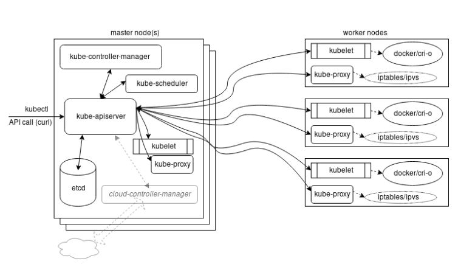
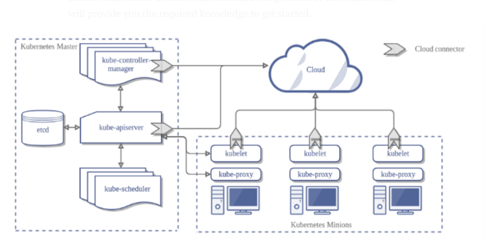

# Installation and Configuration

* [Home](/README.md)

## What to learn

* Discuss the main components of a Kubernetes cluster.

* Learn details of the master agent kube-apiserver.

* Explain how the etcd database keeps the cluster state and configuration.

* Study the kubelet local agent.

* Examine how controllers are used to manage the cluster state.

* Discover what a Pod is to the cluster.

* Examine network configurations of a cluster.

* Discuss Kubernetes services.

## Main Components 

* Master and worker nodes
* Controllers
* Services
* Pods of containers
* Namespaces and quotas
* Network and policies
* Storage.

See the below images to get an idea what it looks like

## Master Node

The Kubernetes master runs various server and manager processes for the cluster. Among the components of the master node are the **kube-apiserver**, the **kube-scheduler**, and the **etcd database**. As the software has matured, new components have been created to handle dedicated needs, such as the **cloud-controller-manager**; it handles tasks once handled by the **kube-controller-manager** to interact with other tools, such as Rancher or DigitalOcean for third-party cluster management and reporting.

### kube-apiserver

* kube-api server is central to the operations of a kubernetes cluster

* all calls both internal and external are handled by this agent

* all actions are accepted and validated by this agent

* it is the *only* connection to the **etcd** database

* validates and configures dat fro API objects and services REST ops

### kube-scheduler 

* uses an algorithm to determine which nodes will host a pod of containers

* it will look at available resources (compute, storage etc) and try to schedule accordingly

* you can also use the schedular to bind a pod to a node

### etc datbase

* holds the state of the cluster

* cluster config, networking and other persistant data 

* its actually more of a *b+tree key-value store*, all new values are appended at the end

### kube-controller-manager

* a core control loop deamon

* interacts with the kube-apiserver to determine the state of the cluster

* manager will contact the controller to make changes to match desired state

* cloud-controller-manager interacts with agents out side of the cloud

## Worker nodes

All worker nodes run the kubelet and kube-proxy, as well as the container engine, such as Docker or rkt. Other management daemons are deployed to watch these agents or provide services not yet included with Kubernetes.

The kubelet interacts with the underlying Docker Engine also installed on all the nodes, and makes sure that the containers that need to run are actually running. The kube-proxy is in charge of managing the network connectivity to the containers. It does so through the use of iptables entries. It also has the userspace mode, in which it monitors Services and Endpoints using a random port to proxy traffic and an alpha feature of ipvs

## Kubelet

The kubelet agent is the heavy lifter for changes and configuration on worker nodes. It accepts the API calls for Pod specifications (a PodSpec is a JSON or YAML file that describes a pod). It will work to configure the local node until the specification has been met

Should a Pod require access to storage, Secrets or ConfigMaps, the kubelet will ensure access or creation. It also sends back status to the kube-apiserver for eventual persistence, theses actions include

* Uses of PodSpec

* mounts volumes to a Pod

* downloads secrets

* passes request to local container engine

* reports status of Pods and node to cluster