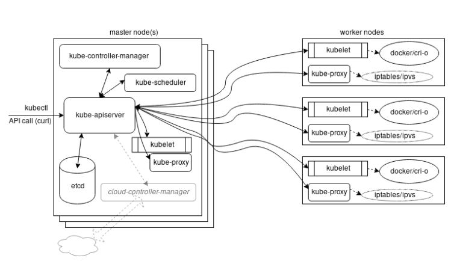
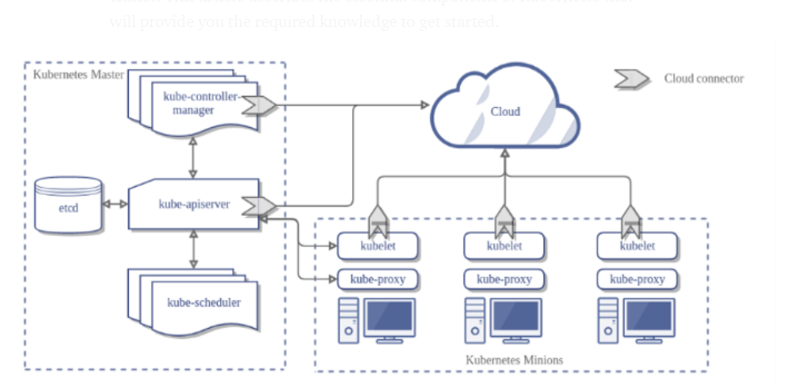

# Kubernetes Architecture

* [Home](/README.md)

## What to learn

* Discuss the main components of a Kubernetes cluster.

* Learn details of the master agent kube-apiserver.

* Explain how the etcd database keeps the cluster state and configuration.

* Study the kubelet local agent.

* Examine how controllers are used to manage the cluster state.

* Discover what a Pod is to the cluster.

* Examine network configurations of a cluster.

* Discuss Kubernetes services.


## Main Components 

* Master and worker nodes
* Controllers
* Services
* Pods of containers
* Namespaces and quotas
* Network and policies
* Storage.


See the below images to get an idea what it looks like






## Master Node

The Kubernetes master runs various server and manager processes for the cluster. Among the components of the master node are the **kube-apiserver**, the **kube-scheduler**, and the **etcd database**. As the software has matured, new components have been created to handle dedicated needs, such as the **cloud-controller-manager**; it handles tasks once handled by the **kube-controller-manager** to interact with other tools, such as Rancher or DigitalOcean for third-party cluster management and reporting.

### kube-apiserver

* kube-api server is central to the operations of a kubernetes cluster

* all calls both internal and external are handled by this agent

* all actions are accepted and validated by this agent

* it is the *only* connection to the **etcd** database

* validates and configures data from API objects and services REST operations

### kube-scheduler 

* uses an algorithm to determine which nodes will host a pod of containers

* it will look at available resources (compute, storage etc) and try to schedule accordingly

* you can also use the schedular to bind a pod to a node


### etc datbase

* holds the state of the cluster

* cluster config, networking and other persistant data 

* its actually more of a *b+tree key-value store*, all new values are appended at the end

### kube-controller-manager

* a core control loop deamon

* interacts with the kube-apiserver to determine the state of the cluster

* manager will contact the controller to make changes to match desired state

* cloud-controller-manager interacts with agents out side of the cloud

## Worker nodes

All worker nodes run the kubelet and kube-proxy, as well as the container engine, such as Docker or rkt. Other management daemons are deployed to watch these agents or provide services not yet included with Kubernetes.

The kubelet interacts with the underlying Docker Engine also installed on all the nodes, and makes sure that the containers that need to run are actually running. The kube-proxy is in charge of managing the network connectivity to the containers. It does so through the use of iptables entries. It also has the userspace mode, in which it monitors Services and Endpoints using a random port to proxy traffic and an alpha feature of ipvs

## Kubelet

The kubelet agent is the heavy lifter for changes and configuration on worker nodes. It accepts the API calls for Pod specifications (a PodSpec is a JSON or YAML file that describes a pod). It will work to configure the local node until the specification has been met

Should a Pod require access to storage, Secrets or ConfigMaps, the kubelet will ensure access or creation. It also sends back status to the kube-apiserver for eventual persistence, theses actions include

* Uses of PodSpec

* mounts volumes to a Pod

* downloads secrets

* passes request to local container engine

* reports status of Pods and node to cluster

## Services

With every object and agent decoupled we need a flexible and scalable agent which connects resources together and will reconnect, should something die and a replacement is spawned. Each Service is a microservice handling a particular bit of traffic, such as a single NodePort or a LoadBalancer to distribute inbound requests among many Pods.

A Service also handles access policies for inbound requests, useful for resource control, as well as for security. 

A service:

* connects pods together

* exposes pods to the internet

* decouples settings

* can be used to define pod access policy 

## Controllers

An important concept for orchestration is the use of controllers. Various controllers ship with Kubernetes, and you can create your own, as well. A simplified view of a controller is an agent, or Informer, and a downstream store. Using a DeltaFIFO queue, the source and downstream are compared. A loop process receives an obj or object, which is an array of deltas from the FIFO queue. As long as the delta is not of the type Deleted, the logic of the controller is used to create or modify some object until it matches the specification. 

The Informer which uses the API server as a source requests the state of an object via an API call. The data is cached to minimize API server transactions. A similar agent is the SharedInformer; objects are often used by multiple other objects. It creates a shared cache of the state for multiple requests. 

A Workqueue uses a key to hand out tasks to various workers. The standard Go work queues of rate limiting, delayed, and time queue are typically used. 

The endpoints, namespace, and serviceaccounts controllers each manage the eponymous resources for Pods.

## Pods

The whole point of Kubernetes is to orchestrate the lifecycle of a container. We do not interact with particular containers. Instead, the smallest unit we can work with is a Pod. Some would say a pod of whales or peas-in-a-pod. Due to shared resources, the design of a Pod typically follows a one-process-per-container architecture.

Containers in a Pod are started in parallel. As a result, there is no way to determine which container becomes available first inside a pod. The use of InitContainers can order startup, to some extent. To support a single process running in a container, you may need logging, a proxy, or special adapter. These tasks are often handled by other containers in the same pod.

There is only one IP address per Pod, for almost every network plugin. If there is more than one container in a pod, they must share the IP. To communicate with each other, they can either use IPC, the loopback interface, or a shared filesystem.

While Pods are often deployed with one application container in each, a common reason to have multiple containers in a Pod is for logging. You may find the term sidecar for a container dedicated to performing a helper task, like handling logs and responding to requests, as the primary application container may not have this ability. The term sidecar, like ambassador and adapter, does not have a special setting, but refers to the concept of what secondary pods are included to do.

## Containers 

While Kubernetes orchestration does not allow direct manipulation on a container level, we can manage the resources containers are allowed to consume. 

In the resources section of the PodSpec you can pass parameters which will be passed to the container runtime on the scheduled node: 

```yaml
resources:
  limits: 
    cpu: "1"
    memory: "4Gi" 
  requests:
    cpu: "0.5"
    memory: "500Mi"
```

Another way to manage resource usage of the containers is by creating a ResourceQuota object, which allows hard and soft limits to be set in a namespace. The quotas allow management of more resources than just CPU and memory and allows limiting several objects. 

A beta feature in v1.12 uses the scopeSelector field in the quota spec to run a pod at a specific priority if it has the appropriate priorityClassName in its pod spec.

## Init containers

* why?? **Used to perform some action to set up or before a Pod comes online**

Not all containers are the same. Standard containers are sent to the container engine at the same time, and may start in any order. LivenessProbes, ReadinessProbes, and StatefulSets can be used to determine the order, but can add complexity. Another option can be an Init container, which must complete before app containers will be started. Should the init container fail, it will be restarted until completion, without the app container running. 

The init container can have a different view of the storage and security settings, which allows utilities and commands to be used, which the application would not be allowed to use.. Init containers can contain code or utilities that are not in an app. It also has an independent security from app containers.

The code below will run the init container until the ls command succeeds; then the database container will start.

```yaml
spec:
  containers:
  - name: main-app
    image: databaseD 
  initContainers:
  - name: wait-database
    image: busybox
    command: ['sh', '-c', 'until ls /db/dir ; do sleep 5; done; '] 
```

## Node(s)

A node is an API object created outside the cluster representing an instance. While a master must be Linux, worker nodes can also be Microsoft Windows Server 2019. Once the node has the necessary software installed, it is ingested into the API server.

At the moment, you can create a master node with `kubeadm init` and worker nodes by passing join. In the near future, secondary master nodes and/or etcd nodes may be joined.

If the kube-apiserver cannot communicate with the kubelet on a node for 5 minutes, the default NodeLease will schedule the node for deletion and the `NodeStatus` will change from ready. The pods will be evicted once a connection is re-established. They are no longer forcibly removed and rescheduled by the cluster.

Each node object exists in the kube-node-lease namespace. To remove a node from the cluster, first use `kubectl delete node <node-name>` to remove it from the API server. This will cause pods to be evacuated. Then, use `kubeadm reset` to remove cluster-specific information. You may also need to remove iptables information, depending on if you plan on re-using the node.

## Single Ip Per Pod

A pod represents a group of co-located containers with some associated data volumes. All containers in a pod share the same network namespace.


To communicate with each other, containers within pods can use the loopback interface, write to files on a common filesystem, or via inter-process communication (IPC). There is now a network plugin from HPE Labs which allows multiple IP addresses per pod, but this feature has not grown past this new plugin.

Starting as an alpha feature in 1.16 is the ability to use IPv4 and IPv6 for pods and services. When creating a service, you would create the endpoint for each address family separately.

## Networking Setup 

Getting all the previous components running is a common task for system administrators who are accustomed to configuration management. But, to get a fully functional Kubernetes cluster, the network will need to be set up properly, as well.

A detailed explanation about the Kubernetes networking model can be seen on the [Cluster Networking](https://kubernetes.io/docs/concepts/cluster-administration/networking/) page in the Kubernetes documentation.

If you have experience deploying virtual machines (VMs) based on IaaS solutions, this will sound familiar. The only caveat is that, in Kubernetes, the lowest compute unit is not a container, but what we call a pod. 

A pod is a group of co-located containers that share the same IP address. From a networking perspective, a pod can be seen as a virtual machine of physical hosts. The network needs to assign IP addresses to pods, and needs to provide traffic routes between all pods on any nodes. 

The three main networking challenges to solve in a container orchestration system are:

* Coupled container-to-container communication (solved by the pod concept).

* Pod-to-pod communication.

* External-to-pod communication 

Kubernetes expects the network configuration to enable pod-to-pod communication to be available; it will not do it for you.

## Pod-to-Pod Communication

While a CNI plugin can be used to configure the network of a pod and provide a single IP per pod, CNI does not help you with pod-to-pod communication across nodes.


The requirement from Kubernetes (for pod to pod communication ) is the following:

* All pods can communicate with each other across nodes.

* All nodes can communicate with all pods.

* No Network Address Translation (NAT).

Basically, all IPs involved (nodes and pods) are routable without NAT. This can be achieved at the physical network infrastructure if you have access to it (e.g. GKE). Or, this can be achieved with a software defined overlay with solutions like:

* Weave

* Flannel

* Calico

* Romana​

See the [Kubernetes Documentation on Cluster Networking](https://kubernetes.io/docs/concepts/cluster-administration/networking/) for more information.

You can also check out [Installing Addons for Kubernetes Page](https://kubernetes.io/docs/concepts/cluster-administration/addons/) for a list of all types of Addons


## Lab 4.1 Basic Node Maintenance 


While the upgrade process has become stable, it remains a good idea to backup the cluster state prior to upgrading.  Thereare many tools available in the market to backup and manage etcd, each with a distinct backup and restore process. We willuse the included snapshot command, but be aware the exact steps to restore will depend on the tools used, the version of thecluster, and the nature of the disaster being recovered from.

```bash
sudo grep data-dir /etc/kubernetes/manifest/etcd.yaml
sudo grep data-dir /etc/kubernetes/manifests/etcd.yaml
kubectl get pods --all-namespaces
kubectl -n kube-system exec -it etcd-k8smaster -- sh
```

*  Find the data directory of the `etcddaemon`. All of the settings for the pod can be found in the manifest. ̃`$ sudo grep data-dir /etc/kubernetes/manifests/etcd.yaml`


* Log into the `etcdcontainer` and look at the options `etcdctlprovides`. Use tab to complete the container name. ̃`$ kubectl -n kube-system exec -it etcd-<Tab> -- sh`

* we are looking for the path of some pki certs

* inside the container `cd /etc/kubernetes/pki/etcd` and then `ls` or `echo *` to see the names of the files you will need

* `exit` the container 

* now lets check the health of the database by using the loopback IP and port 2379.  You will need to pass in the peer cert and key as well as the Certificate Authority as environment variables 

```bash
kubectl -n kube-system exec -it etcd-k8smaster -- sh \ #Same as before
-c "ETCDCTL_API=3 \ #Version to use
ETCDCTL_CACERT=/etc/kubernetes/pki/etcd/ca.crt \ # Pass the certificate authority
ETCDCTL_CERT=/etc/kubernetes/pki/etcd/server.crt \ #Pass the peer cert and key
ETCDCTL_KEY=/etc/kubernetes/pki/etcd/server.key \
etcdctl endpoint health"   #The command to test the endpoint
```

* now we have to figure out how many databases are part of the cluster

```bash
kubectl -n kube-system exec -it etcd-k8smaster -- sh -c \
"ETCDCTL_API=3 etcdctl --cert=./peer.crt --key=./peer.key --cacert=./ca.crt \
--endpoints=https://127.0.0.1:2379 member list"
```

* **It kept breaking** here and of course the Labs offer 0 trouble shooting help so I skipped it.

## Lab 4.2 Working with CPU and Memory constraints

* *NOTE*  The Linux foundation just loves for you to open files in the terminal and make a bunch of crazy edits.

* Nigel Pulton's Course on acloudguru has section on this that is *VIDEO* led and way better.

## Quiz Questions


* What is the smallest object or unit we can work with in Kubernetes?  **pod**

* How many IP addresses can be configured for a Pod?  *just one*

* What is the main configuration agent on a master server? **kube-apiserver**

* What is the main agent on a worker node? *kubelet*

* What object connects other resources together and handles Ingress and Egress traffic? **Service**